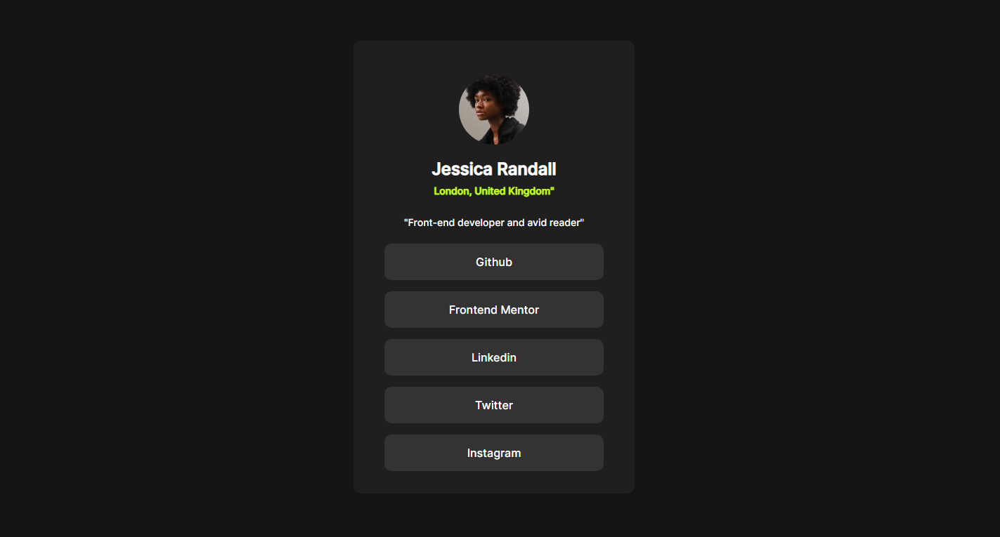

## Table of contents

- [Social Links Profile](#Social-Links-Profile)
  - [The challenge](#the-challenge)
  - [Screenshot](#screenshot)
  - [Links](#links)
- [My process](#my-process)
  - [Built with](#built-with)
  - [What I learned](#what-i-learned)
  - [Continued development](#continued-development)
  - [Useful resources](#useful-resources)
- [Author](#author)
- [Acknowledgments](#acknowledgments)


## Social Links Profile

### The challenge

Users should be able to:

- See hover and focus states for all interactive elements on the page

### Screenshot



### Links

- Solution URL: https://github.com/RuanF7/SocialLinksProfile-css-challenge
- Live Site URL: https://ruanf7.github.io/SocialLinksProfile-css-challenge/

## My process

### Built with

- Semantic HTML5 markup
- CSS custom properties
- Flexbox
- Mobile-first workflow


### What I learned

Centrilize containers(divs), align everything with mobile firts in mind, and also how to reproduce a layout design.

To see how you can add code snippets, see below:

```html
<body>
    <main>
      <div class="main-div">
        <div class="user-div">
          
          <h2>Jessica Randall</h2>
          <h3>London, United Kingdom"</h3>
        </div>
        <div class="description-div">
          <h3>"Front-end developer and avid reader"</h3>
        </div>
      </div>
      <div class="buttons-div">
        <span>Github</span>
        <span>Frontend Mentor</span>
        <span>Linkedin</span>
        <span>Twitter</span>
        <span>Instagram</span>
      </div>
    </main>
  </body>
```

```css
html {
  background-color: hsl(0, 0%, 8%);
  font-family: "Inter", sans-serif;
  display: flex;
  align-items: center;
  justify-content: center;
  height: 100vh;
  width: auto;
  margin: 0;
}

body {
  margin: 0;
  padding: 0;
  display: flex;
  align-items: center;
  color: hsl(0, 0%, 100%);
  justify-content: center;
}

main {
  background-color: hsl(0, 0%, 12%);
  border-radius: 10px;
  width: 400px;
  min-width: 200px;
}

img {
  border-radius: 50%;
  width: 100px;
}

.main-div {
  display: flex;
  justify-content: center;
  align-items: center;
  flex-direction: column;
  padding: 3rem 3rem 0 3rem;
}

.user-div {
  display: flex;
  justify-content: center;
  align-items: center;
  flex-direction: column;
  width: 100%;
}

.user-div h2 {
  margin-bottom: 0.5rem;
}

.user-div h3 {
  font-size: 14px;
  margin-top: 0;
  color: hsl(75, 94%, 57%);
}

.description-div h3 {
  font-size: 14px;
  font-weight: 400;
}

.buttons-div {
  display: flex;
  justify-content: center;
  align-items: center;
  flex-direction: column;
}

.buttons-div span {
  padding: 1rem;
  background-color: hsl(0, 0%, 20%);
  width: 70%;
  margin: 0.5rem;
  align-items: center;
  justify-content: center;
  text-align: center;
  border-radius: 10px;
}

.buttons-div :last-child {
  margin-bottom: 2rem;
}

.buttons-div span:hover {
  background-color: hsl(75, 94%, 57%);
  color: hsl(0, 0%, 12%);
  cursor: url("./assets/images/cursor.png"), auto;
}

}
```

### Continued development

I want to continue developing my front-end skills, speccialy css

## Author

- Website - https://github.com/RuanF7
- Frontend Mentor - https://www.frontendmentor.io/profile/RuanF7
- Linkedin - https://www.linkedin.com/in/ruan-finamor-09853397


